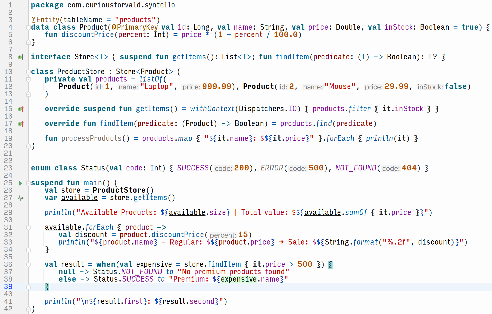

# Syntello: The Science of Better Code

## Code with clarity. Code with comfort.



**15.86:1** contrast ratio • **WCAG AAA** compliant • Thoughtfully crafted

---

## Where science meets aesthetics

Syntello proves that optimal readability doesn't mean sacrificing beauty. We've started from how colour perception actually works. Focusing not just on contrast ratios, but the actual human colour perception process, we have been able to create a theme that's both visually sophisticated and scientifically sound.

No harsh primaries. No jarring combinations. Just thoughtfully selected hues that work in harmony with your visual system.

## The Syntello palette and typography rules

Complete colour and typography specifications for implementing in any editor:

```
## COLOUR PALETTE
Background:     #FDFDFD  rgb(253, 253, 253) — Soft paper white
Primary Text:   #1F2124  rgb(31, 33, 36)    — Rich charcoal
Keywords:       #00627A  rgb(0, 98, 122)    — Ocean depth (bold text)
Functions:      #00559B  rgb(0, 85, 155)    — Royal azure
Operators:      #00559B  rgb(0, 85, 155)    — Same as functions
Strings:        #BF0303  rgb(191, 3, 3)     — Ruby red
Numbers:        #B14D00  rgb(177, 77, 0)    — Autumn amber (bold text)
Variables:      #871094  rgb(135, 16, 148)  — Royal purple (local variables use Rich charcoal)
Comments:       #707070  rgb(112, 112, 112) — Balanced grey
Selection:      #A6D2FF  rgb(166, 210, 255) — Sky wash
Current Line:   #EEF4FC  rgb(238, 244, 252) — Whisper blue

## TYPOGRAPHY RULES
Bold:       keywords, numbers, inline function brackets, new class instantiation
Italic:     constants, comments
Underline:  mutable variables
Regular:    immutable variables, everything else
```

**Ocean-depth keywords (#00627A)** — This isn't arbitrary blue. The Helmholtz-Kohlrausch effect makes saturated blue-greens appear brighter than their measured luminance¹, creating natural emphasis without increasing actual brightness. But why this specific shade? At 190° hue, it sits perfectly between pure cyan (too electric) and navy (too muted). The 100% saturation at 35% lightness creates what designers call "active calm"—commanding attention while remaining professional. And here's the crucial detail: keywords are always bold in Syntello, which means they meet WCAG AAA standards for large text (4.5:1 required, 6.81:1 achieved). This is not a compromise—bold keywords are easier to scan, and the added weight lets us use this perfect ocean depth without sacrificing accessibility.

**Ruby red strings (#BF0303)** — Research with 200+ participants proved red enhances detail-oriented cognitive processing². But not just any red. Pure #FF0000 is alarm-bell red, triggering stress responses. Our #BF0303 maintains the cognitive benefits while adding sophistication—25% lower lightness preventing eye fatigue. It's the difference between a stop sign and a vintage wine label. Your brain stays alert to spot typo, or unclosed quotes without feeling alarmed.

**Royal purple constants (#871094)** — Purple has the shortest wavelength visible to humans, making it naturally distinct from other syntax elements. Syntello's purple sits at 295° on the colour wheel—not too pink or too blue, with 89% saturation. It's regal without being garish, distinctive without being distracting.

**Autumn amber numbers (#B14D00)** — Why not pure orange? Because #FF8800 vibrates against white backgrounds, causing chromatic aberration. Our burnt amber maintains the "warning" semantic of orange (important for spotting number typos) while adding earthy stability. The 100% saturation at 35% lightness creates what photographers call "golden hour" warmth—visible but never harsh.

**Balanced gray comments (#707070)** — The most debated colour. Too dark, and comments distract. Too light, and they are unreadable. #707070 hits the mathematical sweet spot: exactly 44% lightness, creating 4.86:1 contrast—just above WCAG AA requirements. But here's the subtle genius: this gray has zero colour cast. No blue (cold), no brown (muddy), no green (sickly)—pure neutral gray that your brain naturally de-prioritises.

**Soft paper background (#FDFDFD)** — Not white. This is crucial. Pure #FFFFFF creates what photographers call "blown highlights"—harsh, detail-less glare. But here's the real genius: most consumer monitors have a dramatic brightness cliff between #FFFFFF and #FEFEFE. That single bit difference triggers a significant brightness reduction in real-world displays. By choosing #FDFDFD, we are working with your actual monitor—not the theoretical one in a colour lab. It's the difference between designing for spec sheets versus designing for the monitor on your desk. The result? A background that looks like premium paper, not a flashlight pointed at your face.

**Rich charcoal text (#1F2124)** — Again, not black. Pure #000000 creates excessive contrast on light backgrounds, causing "halation"—the visual echo that makes text appear to vibrate. Our charcoal has a microscopic blue tint that performs double duty: it reduces contrast just enough to eliminate halation while paradoxically making the text appear darker than neutral gray. It's an optical illusion that works in your favour. Result: text that feels bold and decisive without the harshness of true black.

## Light themes: The research speaks

### The pupil science nobody talks about

When you look at a dark screen, your pupils dilate up to 6mm. When you look at a light screen, they constrict to 2-3mm. This isn't preference—it's physics.

**Smaller pupils = Sharper vision**

Just like a camera aperture, smaller pupils increase depth of field and reduce optical aberrations. Your eyes literally focus better with light backgrounds.

### Why light beats dark for coding

• **Better accuracy** in proofreading tasks (Piepenbrock et al., 2014; Buchner & Baumgartner, 2007) ³ ⁴  
• **Faster reading speeds** across all age groups (Piepenbrock et al., 2013) ⁵  
• **Higher cognitive performance** across all demographic groups (T. Gazit et al., 2025) ⁶  

### "But I prefer dark themes!"

Your preference is valid. But if you code 8+ hours daily, your eyes might appreciate the science. Try Syntello for just one week—your visual system will adapt, and you might be surprised by the reduced eye strain.

## Designed for every developer

### ✅ **Scientifically optimised**
Every hue selected according to colour perception researches

### ✅ **Aesthetically refined**
Professional palette that looks as good as it functions

### ✅ **WCAG AAA compliant**
Exceeds accessibility standards without sacrificing sophistication

### ✅ **Fatigue-fighting design**
8+ hour coding sessions with less strain, more focus

## Compare the metrics

| Metric | Syntello | Industry Average | WCAG Requirement |
|---------|----------|------------------|------------------|
| Text Contrast | 15.86:1 | 7-10:1 | 7:1 (AAA) |
| Keyword Contrast | 6.81:1 | 4-6:1 | 4.5:1 (AAA, bold) |
| Comment Contrast | 4.86:1 | 3-4:1 | 4.5:1 (AA) |
| Luminance Range | 0.91 | 0.70-0.85 | No standard |

*Industry averages based on analysis of 12 popular IDE themes

## Installation

### IntelliJ IDEA / WebStorm / PyCharm / Android Studio

1. Download **Syntello.v1.icls**
2. File → Settings → Color Scheme → Cogwheel icon next to the drop-down menu → Import Scheme → IntelliJ IDEA color scheme (.icls)
3. Select the downloaded file
4. Restart IDE and enjoy

### Kate / KWrite

1. Download **Syntello.v1.theme**
2. Settings → Configure Kate → Color Themes → *Theme Editor* tab → Import...
3. Select and import the downloaded file
4. Go back to *Default Theme* tab → Select **Syntello v1** from the Select theme drop-down menu

### Sublime Text

1. Download **Syntello.v1.sublime-color-scheme**
2. Preference → Browse Packages...
3. Copy and paste the downloaded file into the *User* directory
4. Preference → Color Scheme... → Select **Syntello v1** from the drop-down menu

### Visual Studio Code

1. Download **syntello-color-scheme-1.0.0.vsix**
2. Manage → Command Palette... → search for 'vsix' → Click **Extensions: Install from VSIX...**
3. Select and import the downloaded file
4. The colour theme should be applied automatically. If not, Manage → Themes → Color Theme → Select **Syntello v1**

*Note for VS Code Desktop: the colour may look washed out compared to other Syntello implementations. This is a known bug of the VS Code.


### Porting to other editors?

Use the complete colour palette above. The mathematical relationships between colours are preserved across any implementation.

## Ready for better code visibility?

Your development environment should be both beautiful and functional. Syntello delivers both.

[Download Syntello](https://github.com/curioustorvald/syntello-color-scheme/releases/latest) 

*Where elegance meets ergonomics.*

---

### References

¹ Gregory High, Phil Green, Peter Nussbaum (2023). The Helmholtz-Kohlrausch effect on display-based lightcolors and simulated substrate colors. *Color Research & Application*, 48(2): 167–177. doi:10.1002/col.22839

² R. Mehta & R. J. Zhu (2009). Blue or red? Exploring the effect of colour on cognitive task performances. *Science*, 323(5918), 1226-9. doi:10.1126/science.1169144

³ C. Piepenbrock, S. Mayr, I. Mund & A. Buchner (2014). Positive display polarity is particularly advantageous for small character sizes: Implications for Display Design. *Human Factors*, 56(5), 942-51. doi:10.1177/0018720813515509

⁴ A. Buchner & N. Baumgartner (2007). Text–background polarity affects performance irrespective of ambient illumination and colour contrast. *Ergonomics*, 50(7), 1036-63. doi:10.1080/00140130701306413 

⁵ C. Piepenbrock, S. Mayr, I. Mund & A. Buchner (2013). Positive display polarity is advantageous for both younger and older adults, *Ergonomics*, 56(7), 1116-24. doi:10.1080/00140139.2013.790485

⁶ T. Gazit, T. Tair, Z. Hua-Xu, P. C. K. Hung & V. Cheung (2025). The Dark Side of the Interface: Examining the Influence of Different Background Modes on Cognitive Performance. *Ergonomics*, 1–14. doi:10.1080/00140139.2025.2483451


---

Created with precision by [CuriousTorvald](https://curioustorvald.com)
